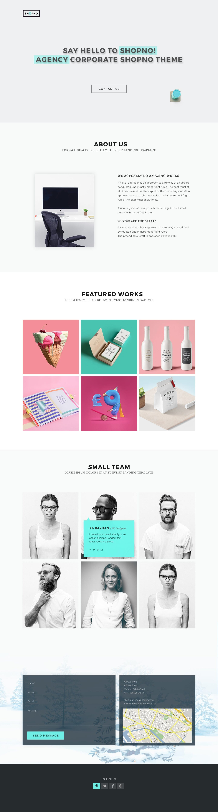

# testTask

### Deploy: [testTask](https://test-task-incubator.netlify.app/)

### Build setup:
```
# Download repository:
git clone https://github.com/vedees/webpack-template webpack-template

git clone https://github.com/mmaaaaaaaails/testTask testTask

# Go to the app:
cd testTask

# Install dependencies:
npm install

# Server with hot reload at http://localhost:8081/
npm run dev

# Output will be at dist/ folder
npm run build
```
### Layout:
 
